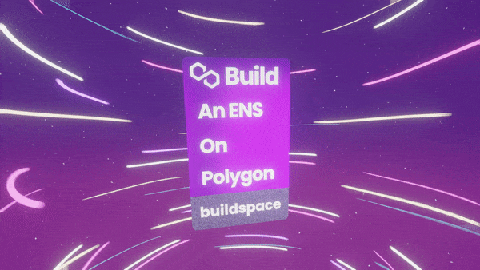

# Basic DNS with NFTs

This project is the result of buildspace's [Build your own domain service on a Polygon L2 in a weekend](https://buildspace.so/p/build-polygon-ens).

It uses hardhat and react, a lot of custom hooks to connect to metamask, change the network to polygon's mumbai testnet, etc.

## NFT

You receive an NFT certificate for each buildspace project finished. Here is the one for the ENS project:



You can check it at [OpenSea](https://opensea.io/assets/matic/0x3CD266509D127d0Eac42f4474F57D0526804b44e/20121?force_update=true) as well.

## Live demo

[DEV Name Server](https://ens-clone-gmuo92llc-brunoscholz.vercel.app/)

## Development

You must have the [Metamask extension](https://metamask.io/download/) on your browser.

```
$ git clone https://github.com/brunoscholz/ens-clone.git
```

Create a .env file and place the following variables:

```
PRIVATE_KEYS="..."
ALCHEMY_MUMBAI_API_KEY=...
```

PRIVATE_KEYS is the private key to the account you are testing with. You can get this on metamask account details -> expose private key. This will be used by hardhat to deploy the contract for the NFT-ENS.

ALCHEMY_MUMBAI_API_KEY is the secret key of your app. You can create one [here](https://www.alchemy.com/).


```
$ yarn && yarn start
```

Go to [localhost:3000](http://localhost:3000)

Be sure to have some MATIC on your account ([Polygon Test Faucet](https://faucet.polygon.technology/)).
